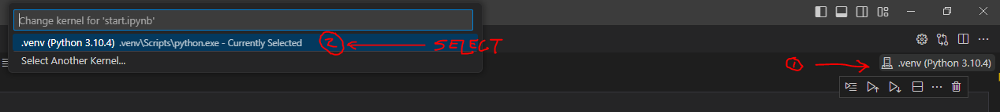

# csc-498-F24
Fall 2024 Capstone Project Jupyter Notebook

# Jupyter Notebook Class

## Setup Instructions

1. Clone the repository

2. Create a virtual environment:
   ```bash
   python -m venv .venv
   ```

3. Select the virtual environment for the VS Code Context:
   * Click on the upper right-hand corner where it says "Select Python Interpreter"
   * Select the virtual environment that you just created (it should be in the .venv directory)
   

4. Activate the virtual environment:
   - On Windows:
     ```bash
     .venv\Scripts\activate
     ```
   - On macOS/Linux:
     ```bash
     source .venv/bin/activate
     ```

5. Install the dependencies:
   ```bash
   pip install -r requirements.txt
   ```

